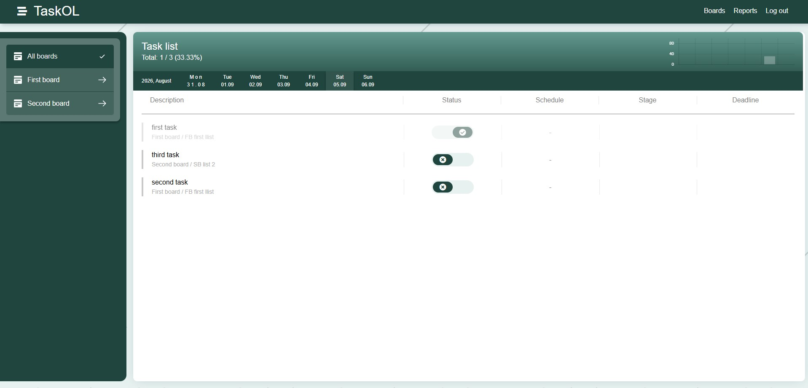
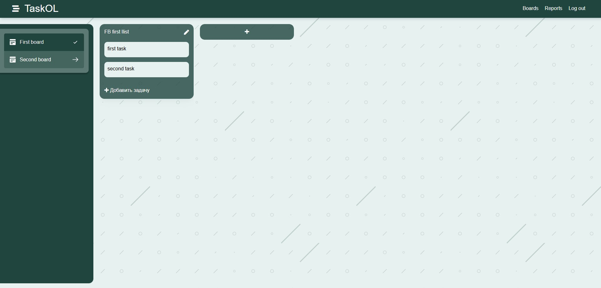
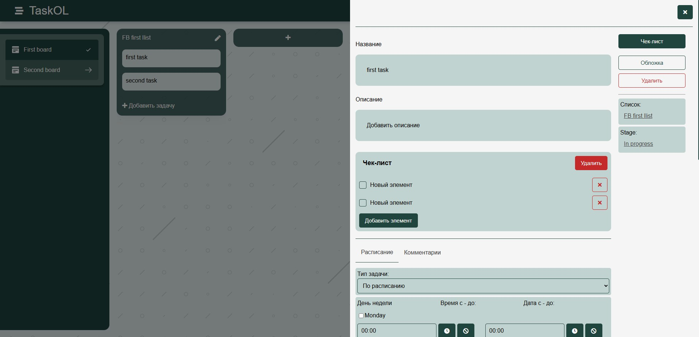
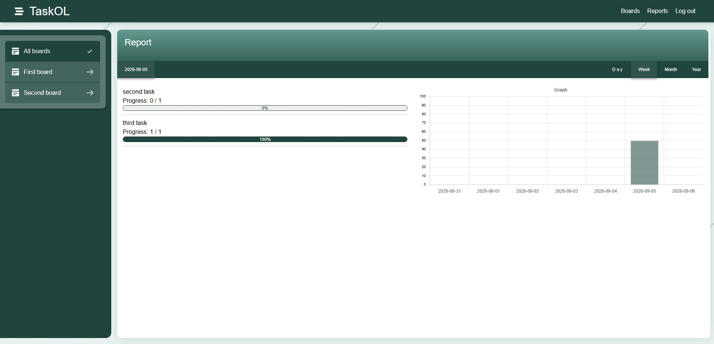

Веб-приложение для управления личными задачами.

Функциональность:
- создание задач;
- дедлайны и расписания;
- Kanban-доски;
- отчёты по выполненным и невыполненным задачам;
- комментарии;
- чек-листы

Стек:
- PHP
- MySQL
- JavaScript/jQuery
- Docker
- Nginx
- Make

